# **Milestone Project 4**  - Full Stack. 

## **Fytletic - Fighter Networking Solution**


Fytletic is currently deployed and can be visited directly at Heroku **[Fytletic  ](https://fytletic.herokuapp.com/)**

###  **For testing the following login and test card credentials are valid:**


**Member Login**
- Username: fytletic_test
- Email: test@fytletic.com
- Password: fyt_001

**Card payments**
- Card number: 4242 4242 4242 4242
- Zip & CCV: any integer values are valid

Note: This project contains a store app which orders will not be fullfilled nor payments taken, Stripe test keys used only. This is for testing purposes only. 

---
## 📓 **About the project:**

**Fytletic**  - Professional Fighter and Gym Network, allowing users to register create manage and maintain their professional Fighter CV.

## 💻️ **Technologies Used:**
___

* **[HTML](https://developer.mozilla.org/en-US/docs/Web/HTML):** - 
Is the main language used in this project which allowed me to correctly structure the website, whereby using best practices to use semantic tags where appropriate.

* **[CSS](https://developer.mozilla.org/en-US/docs/Web/CSS):** - Was used via an external stylesheet using best practices to style format and visually present the HTML.

* **[DJANGO](https://www.djangoproject.com/):** - A Python framework 

* **[BOTO3](https://boto3.amazonaws.com/v1/documentation/api/latest/index.html):** - Allows you to directly create, update, and delete AWS resources from your Python scripts.

* **[GUNICORN](https://gunicorn.org/):** - The Gunicorn "Green Unicorn" is a Python Web Server Gateway Interface HTTP server. 

* **[PILLOW](https://pillow.readthedocs.io/en/stable/):** - A functional drop-in replacement for the Python Imaging Library

* **[PSYCOPG](https://www.psycopg.org/):** - A PostgreSQL adapter for the Python programming language.

* **[AWS](https://aws.amazon.com/):** - Amazon Web Services, used to store Media.

* **[STRIPE](https://stripe.com):** - A payments processor allowing us to handle card payments on the site.

* **[HEROKU](https://www.heroku.com/):** - Heroku is a container-based cloud Platform as a Service (PaaS). Used in this project to deploy the live site to the web.

* **[PYTHON](https://www.python.org/):** - Python is a backend programming language used for the CRUD functionality of this application.

* **[MYSQL LITE](#):** - MYSQL-LITE database,

* **[POSTGRES]():** - Used in user password hashing and security for the application.

* **[RANDOMKEYGEN](https://randomkeygen.com/):** - Website used to generate secure passwords, used in this application for ***SECRET_KEY***.

* **[JAVASCRIPT](https://developer.mozilla.org/en-US/docs/Web/JavaScript):** - *As part of Bootstrap* Javascript although I haven't programmed it, was included in the site as part of the Bootstrap framework so that some Bootstrap components such as the navigation toggler would work.

* **[EMAILJS](https://email.js.com):** - *As part of Bootstrap* Javascript although I haven't programmed it, was included in the site as part of the Bootstrap framework so that some Bootstrap components such as the navigation toggler would work.

* **[BOOTSTRAP](https://getbootstrap.com/):** - The framework for the site allowing the use of the Bootstrap grid and responsive mobile-first approach. I Used many components from Bootstrap mainly, the Carousel, Navbar, forms and modals. 
* **[MDBOOTSTRAP](https://mdbootstrap.com/):** - The framework based on Google Material Design for Bootstrap. 

* **[GITPOD](https://gitpod.io/):** - IDE for this project. Allowed me to fork the Code Institute template from Github and open in Gitpod so that all extensions were available.

* **[GIT](https://git-scm.com/):** Git employed as version control

* **[GITHUB](https://github.com/):** - Github was used to host the repository for this project.

* **[SQUOOSH](https://squoosh.app/):** - I used Squoosh to reduce the image sizes

* **[PHOTOSHOP](https://www.adobe.com/uk/products/photoshop.html):** - For editing images associated with this project.

* **[BALSAMIQ](https://balsamiq.com/):** - Mac version to develop wireframes for this project.

* **[CHROME](https://www.google.com/intl/en_uk/chrome/):** - Not only did I use Chrome extensively for testing and bug fixing but I used the following extensions :

* **[PESTICIDE](https://www.google.com):** -  This extension inserts (with auto-reload) the Pesticide CSS into the current page, outlining each element. - Giving a good visual representation of containers rows etc, as I was using a material design from MDBootstrap I was inserting containers into containers in points to get the desired layout and style, this extension allowed me to view the layout correctly. 

* **[RESPONSIVE VIEWER](https://chrome.google.com/webstore/detail/responsive-viewer/inmopeiepgfljkpkidclfgbgbmfcennb):** -  An excellent extension suggested to me by my Mentor Allen - A Chrome extension to show multiple screens in one view. the extension will help front-end developers to test multiple screens while developing responsive websites/applications.

* **[GIFY](https://giphy.com/):** - Used to create the .gif file in readme depicting the responsive viewer in action and showing my testing on different screen sizes. 

* **[WEB FONT GENERATOR](https://www.fontsquirrel.com/tools/webfont-generator):** - Used to bring in a custom font I wanted to use for the main H1/ H2 sections, custom branding.

* **[AM I RESPONSIVE](http://ami.responsivedesign.is/):** - Used to generate the header image displayed at top of Readme.MD file depicting 4 screen displays.

* **[FAVICON](https://favicon.io/):** - Used to generate the favicon

* **[CSS BEAUTIFIER](https://www.freeformatter.com/css-beautifier.html):** - Formats a CSS files with the chosen indentation level for optimal readability. Supports 4 indentation levels: 2 spaces, 3 spaces, 4 spaces and tabs.

* **[PRETTIER](https://prettier.io/):** - Prettier is an opinionated code formatter for HTML CSS JavaScript etc

* **[PEP8 COMPLIANCE CHECKER](http://pep8online.com/):** - A free tool to allow the user to check their python code, to ensure it conforms to the PEP 8 standard. 

* **[BLACK](https://github.com/psf/black):** - Black is the uncompromising Python code formatter.

* **[DB SCHEMA . DOT](https://dreampuf.github.io/GraphvizOnline/ ):** - For automatic generation of Db Schemas from .dot file and .json


 

___

## 🧑‍🎨 **UX:** **User Experience Design (UX)**

 __Developed from the coding institute full stack web developer module on UX design.__

**What is UX:**

User Experience Design is the work, processes and skillsets involved in creating useful useable products which provide value not only to the customer but the business owner ensuring that a product not only works but is intuitive, simple, and enjoyable to use. A good UX experience is achieved by following a defined process called User Centred Design or UCD for short.

I have chosen to create a Fight network with ecommerce and full C.R.U.D functionality and also login and registration forms, following best practice UX principals and will apply them to reassess the current needs and wants of my customers and future potential clients.

It will have the ability for users to register to the site upload their fighter data and create gyms if they own such facilities. 

With this full stack project i aim to cover all user stories and cover all of the planes of UX and development.


## 💡 **Strategy plane: The Initial idea.**
___
The basis behind Fytletic was to create a full stack Django web app which allows established and upcoming fighters from all disciplines a place to register their details online to create a fighter community and network. 

It’s prime function is to  provide a simple profile that fighters can create for themselves and keep it updated with all essential criteria linked to their profile(criteria which will be addressed in my models and schemas later). Creating a user based personal online fight CV. 
Not only that but Gym owners can create specific gym listings, showcasing their skills, facilities, opening hours and even link to fighters who train there.

A function which will be initially built in the first phase of production will also be a news center of sorts which registered users will be able to read, information will include nutrition advice, training tips, fight news and more. The data will be blocked for unregistered users however a small snippet somewhat like Medium may be enforced in order to encourage people to sign up to the site. 

The over all goal of the site is to become the worlds largest database of fighters, fight gyms and fight/Athelete information. 

There will be a merchandise shop and system in place using technologies for payment Gateway for example stripe. The webshop will track orders and link them to individuals profiles. Initially this service isnt needed to create the MVP however for an example of my developement skills i will include these models for this project version. 


As a developer and from a development standpoint my primary aim is to bring together many of the technologies I have learned so far to then use these technologies and comprehensively display data in a comprehensive and easy to digest manner. I aim to bring in user-generated data using forms (through an Add gym or fighter form page using Django FORMS) and python linked to Postrgres. Thus highlighting the many skills I have obtained during this course. 

 By completing a fully functioning profiling site, I will have demonstrated my experience in developing a Python-based web application with CRUD functionality.


 ## **About the business:**

The web application will be entirely online and is concerned with real-life professional and amateur fight profiles from users who can sign up to the site for zero cost to themselves, simply by registering for an account. The primary aim of the website is to display fight and gym profiles from users and allow them to display their achievements / stats and information to accomplish two things, 1. Exponential growth through sharing of the website and 2. Expand awareness of their profile as an athlete and fighter. This may be from using the web app to connect and reach out to other fighters, or use it as an online 'CV' to showcase their statistics. 

 ### **Strategy to deliver above.**

* A clear and simple design starting with the Hero section displaying the Name and tag line to establish the message of the site.
In this case FYTLETIC - Professional Fight Network.


**Branding:**
* I own the domain name https://fytletic.com and my business name follows suit with the strapline and business idea name. Fytletic is a play on two words , Fighting and Athletic. I beleive Fytletic is an easily rememberable name which translates well to a brand name.

* Logo - will be a simple design based on the letter F and L . Or will be based simply on the business name of Fytletic.

 ### **Strategy to deliver above.**

All of the below points should fulfil 'user first impressions' (see table below) and is especially important in our B2C business.

*	Develop a logo – which is simple but effective, based on the letters F and L  and try to symbolise a link between fitness, wellbeing and the relationship of the letters. See Logo on the deployed site for the final design. The logo will also act as a link back to the home page as common practice. Increasing credibility and trustworthiness.
After some developement, i have found that the best option for the logo is to use the Fytletic play on words, using a combination of Bold italic and thin variations of the “Montserrat” font, which subsequently is also used as the main type face of the web app, i feel this works as it adds to the simlistic approach to the branding of the site.

* A simple design structure with a navigation bar and side navigation on smaller screen resolutions accessible on every page will be essential for allowing users and readers to 'learn' the site and layout/functionality with ease. There should also be a home button/link on the logo for each page and subsequent back/return to the fighters and gyms profile. I will ensure that a back button is generated on each page so that the user doesn't have to use the browser back button as this is bad UX. 

*	Develop a professional colour scheme – check out competitors in not only UFC but other athletic based business websites. Use consistently throughout the site. For this colour scheme, I have gone with a dark blue and greys signifying trust, honesty and dependability, therefore helping to build customer and userbase loyalty, i also feel like i wanted the site to come across as a professional body. 


- After researching other fitness and fighting related sites combined with reading this medium article [How to use color Psychology ](https://medium.com/@jelly.shah/how-to-use-color-psychology-to-create-a-perfect-fitness-website-7e9f200c7f16), 

* [Wikipedia - Colour Psychology](https://en.wikipedia.org/wiki/Color_psychology)


and this wikipedia article  I developed the colour pallete below  using [Adobe Colour Pallete](https://color.adobe.com/create). 

* I have also researched colour palettes and other brands before making any decisions on my final approach you can find  the extra infomation on that research here: 

* **[PDF- Colour Pallete research.](media/docs/fytletic_research.pdf):**

**Final Colour Pallete**

* Blue - Corporate, high quality 
* Purple -  Authority, Sophistication, power
* Grey  - Conventional, dependable and practical

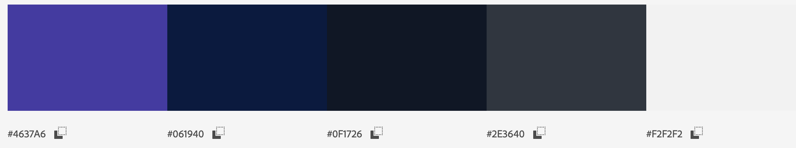


*	Choose a font type for the project which reflects what we are trying to achieve – research other platforms and use similar fonts.  “Montserrat”  will be used consistently throughout this site. The logo and business name  will employ ‘Montserrat font’ consistently. Again I have used this method from my previous milestone projects as I feel in my portfolio I wish to create a style for myself, following on from similar design and practices.

*	Utilise the bootstrap card and grid system to display the user's fight and gym data in a logical and easy to ‘learn’ manner.

*	Develop a footer with info section or simple copyright info bar.


| User first impressions        | How to achieve          |
| ------------- |:-------------:|
| **_Does it look credible and trustworthy?_**  | Yes – through the colour palette, fonts,  logo, social proof of good quality control and reviews. |
| **_Does it offer what I want?_**  | Yes – Simple use of CRUD functionality and achieves only what is intended, users the ability to register to the site, add fighters, gym data and also edit and delete that data. Readers of the site can view fighter stats and gym data on the home page and view extended versions of the individual generated templated pages , with easy access back to the main home page and or relevant sections of the site they are on. |
| **_Does it look valuable enough for me to stay?_**  |.Professional design, clear and simple navigation, displayed is an easy to read manner. Mobile responsive. |
| **_Does it look valuable enough for me to return?_**  | Yes, free to use but professional design, deployed on a secure platform, quick responsiveness and easy to 'learn' with all features of a review site available |
| **_What actions can I take now?_**  | Users who aren't logged in will see a clear navigation item which says 'register' and also registered users will see an enhanced menu structure to allow them to use the site effectively |
| **_How do I learn more?_**  | An F.A.Q section on the site will be made available in the footer section to allow users to find the answers to their questions with relative ease  |
| **_How do I contact someone?_**  | Footer provides direct contact details for the webmaster. Similarly, a web form can be accessed from a menu item called 'Contact'|


**What is culturally appropriate**

* As this is primarlily a fighter and gym network  I have found that the brand name stands for a lot right from the offset. Our website is only concerned with displaying information within the fight (for example UFC / Boxing) industry, and the fitness industry. We will not be extending our reach in to other similar industries for example cooking (which may be related to nutrition and fitness)

* We keep the site strictly about professional organised and amateur fighting  and focus solely on providing the users with the ability to create their professional online CVS , edit and delete them. They will also be able to build up their name as an athlete and fighter. 
By giving the user the ability to update their own profiles, it is encouraging to the user to frequent the site and keep the data being stored about them up to date, including contact details, fight statistics training regimes etc. So again allowing us to create a self building site of relevant user generated content. Not only that but by building on a Django base alongside python we can ensure that we can consistently keep adding improvments and features which users may want and request, for example a follow or messaging service, this allowing users to contact each other and stay on the platform.

* I have also developed the site to be mobile-first as our demographic for clients looking for our services seems to be in the male category and age range of 16-34, whereby we know its highly likely that users have access to a smartphone and will be accessing our website from mobile.

**Tracking and cataloguing content in an intuitive way.**

* Regarding the display of the content I have opted for a typical section style layout to the site, this meaning I have a hero section and subsequent blocks of content each separated by alternating background colours, an off white and white to ensure content separation is apparent. 

* The use of Djngo /Python for loops will allow the display of user generated content in a card, each iteration will generate a new card with the subsequent fighter name image and more button. In time I may break these loops down to fighter Discipline specific headings, for example Boxing, UFC  and even make fighters and gyms searchable by these extended options, however as the site is in its infancy I have opted to generate all reviews in cards utilising the bootstrap grid system displaying no more than three cards per row, time permitting i may employ a pagination system, instead of generating long loops of data.

* Typically in modern web design, a hero section is employed so I have taken advantage of that with a centred H1 and H2 Heading for the site title and strapline, using a more bolded font to make an impact from the first-page load. This screams to the user, this is the site title and this is what you can do here.

* I also used a background image which is relevant (in this case a glove on rope) to display the field the website is addressing (fighting /combat of some description). One concern is that on fighter profiles, if a user uploads a  bright image it may distract  from the Hero text, so a background overlay maybe used in order to fix this. At present i havent employed this on user generated data however with keeping to the branding pallete of the site i have employed an overlay system on the main navigation hero sections.  Not only that but the background overlay is the main colour in the colour palette chosen again adding to our branding and overall UX experience for the potential client.

**What is the importance of this.**

* From the first time the user visits the website we want to display a level of professionalism and ease of use, not only that our straplines, branding and colour palettes are correct but our content is distraction-free and displayed easily enough that a user can learn about our website and feel at ease very quickly. 

* With minimal distractions and a simple interface, it will become easy for the user to quickly learn the site and sign up for an account and start creating custom content for the site. 

**Why would a user want this.**

 * Its important to quickly allow the user to learn the site sign up and create content with little distractions as possible. I have deliberately simplified the application to allow for this. After re watching the sections on development of software i have become well aware of the YAGNI  and KISS principles, this i have designed the site to be deliberatly simple and learned easily by any kind of user.  Typically a user from visiting the site can sign up and create their fighter profile in less than 5 steps. 

1. Visit the application 
2. Click Register
3. Register account.
4. Click add fighter profile. / gym profile 
5. View Published profile. 

This ease of use and free registration will encourage return users to the platform and again allow users to grow through external content creation. 


**What creates a good User Experience concerning this online Fighter and gym profile business.**

*	Strong branding – colour palette – typical industry typography.
*	Displaying relevant content. - From only hosting/allowing correct and verified data from users and displaying content which is of value to readers.
*	Social proof – adding social sharing to all fight and gym submissions allows for users to share their profiles and in return increases traffic to our web application.
*   Overall ease of use, as highlighted above, the 5 steps from learning the site to publishing is imperative. I have used previous sites which require far more effort and are often more complicated to learn. Simplicity is key.


**What does the user/client expect?**

*	Strong Branding- Does this website come across as an authority in its field. I feel this is true by the use of correctly structured content, branding font type and also consistency throughout.
*	Pricing – This is completely free, we may in our terms allow free use to contact users at a later date to offer other premium services. 
*	Ease of use? - 5 steps from initial visit to signing up and publishing the first review.
* Support - this is currently only available from a contact form, however as the site is simple and efficient I believe this is a minor addition to the free service provided. 


**Prioritisation – To launch a Minimal Viable Product.**

* We can address which features should be prioritised primarily by developing a map of importance and viability/ feasibility.
For this project, we will be focusing on UX efforts of higher importance and developing features of lower importance and viability/feasibility further in the timeline of this project.


| Opportunity/Problem       | Importance         | Viability  |
| ------------- |:-------------:| -----:|
| **_A.     Allow users to register and create publishing account_**       | 5 | 5 |
| **_B.     Display each gym and fighter on their own page_**      | 5      |   4 |
| **_C.     develop a follow /twitter type system for users to follow each other_** | 3      |    2 |
| **_D. Add latest news and fighters to the front page_** | 4      |    5 |
| **_E.     Group fight profiles to categories_** | 2      |    2 |


**Graph of importance to launch our MVP from the previous table.**

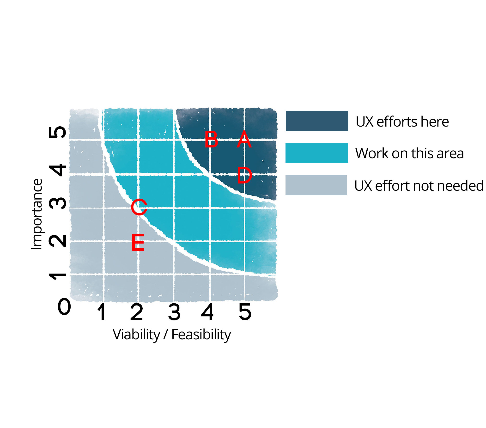


As referencing the above prioritisation matrix my UX efforts will be hence focused on areas A and B which will satisfy the CRUD app criteria of the grading process. 
Thus I will develop the application to allow users to register and create their accounts whilst also displaying their profiles for fighters and gyms. 


## 🧰 **Scope Plane - requirements and functional specifcation**
___
### **What users and stakeholders - Say they need**
**User Stories**


* Speaking to several professional and unprofessional fighters from a number of disciplines, I concluded that they want somewhere which provides the correct tools such as their own personal branded page to display their fighter stats and data, not only do they want this for their own record keeping, but they feel it would be a great tool to expand their network and gain exposure, an online fighters Cv as it were, they also would like to create their own blogs and news, which could then be associated to their own public channel. 

* Again this helps with their self promotion and ability to gain better exposure in order to promote themselves within the fight world as this is a crucial step in helping them progress with their career endevours. 

* The user visiting this type of website wants a professional website easy to navigate and also read profiles of upto date and relevant content, for in this instance - Other like for like fighters or gyms which suit their fighting expertise. 


* They need to be able to to search for these gyms and fighters the user can increase their network and make connections which would have previously not been available to them. 

* Not only that but if the user wishes to use the site to publish their own news reports they will also require a site that will allow full CRUD functionality, simplistic to use and allow their content to be displayed in an easy to read and eye inviting manner. 

* They need to be able to share their work across platforms. 


### **What users and stakeholders - Actually need**
They need a clean and tidy designed website which is mobile responsive, highlighting the latest fighters, gyms and up to date news and information. A button from the front page known as a CTA will take them straight to the latest updates for the site, this was a primary reason for including entries in the database models such as profile CREATED on, so this is possible from the beginning of production.

* As a user/publisher on the site, they require ease of use with full CRUD functionality, to publish amend or even delete their fighter profile stats and associated information. 

* They will also need a means of sharing said content with others on their social networks or to potential sponsors. 

### **What users and stakeholders - Don't know they need.**

* As the site owner, they will want to be able to monitor and update the site, I have initially started this process by creating an admin user who can create new entries for all applications in a customised and ordered backend admin area, this can be found by logging in as the super user and navigating to the admin panel. 

* As a working business website, we have to abide by GDPR rules, so a pop up advising the client on our privacy and how we use their information would be needed down the production line. This production app will not have this in place but will be if deployed.

* Other desirable features may include, more services for advertisement and online merchandise store with inventory (at current the shop functions as a working shop but doesnt fulfil orders.)

* Social networking feature – not essential but desirable, perhaps a Twitter/Facebook like entity where users can register to the site share their tips and advice, this would allow for content to be shared cross-platform and to other social media accounts, drastically increasing awareness of our web application. Or for people to use the site as a personal fight blog, create friends and discover shared interests. Being able to interact with other users on the site i feel would drastically improve the useablility of the site in general.

* Figher connections and online status - being able to chat and speak with online fighters will create more of a network feel to the site unlike a database of fighters, i feel the two would work well together.

* An iOS and android app – it is true that many users now if these features down the line are implemented that developing an application would be of extreme benefit, it would allow extra monetisation brand awareness and next-level professionalism.


## User Stories continued - table ammended  and added to from user stories set out in **_Project ADO_**


|                   | As a     | I want to...                                              | So that..                                                                                       |
|--------------------------------|--------------|---------------------------------------------------------------------|------------------------------------------------------------------------------------------------------|
| **_Viewing and Navigation_**         |              |                                                                     |                                                                                                      |
| 1                              | Site Visitor | Discover Fytletic                                   | Learn more about what the website plans to achieve - Fighter and Gym Profiles alongside news and fitness information.                                                |
| 2                              | Site Visitor | View a list of products                                             | Select a product to view more details                                                                |
| 3                              | Site Visitor | View a list of Fighters and Gyms                                          | Select a fighter or gym to view more details to learn more about that fighter or gym.                                                           |
| 4                              | Site Visitor | View a specific category of products using search functionality                              | Quickly find products I’m interested in without having to search through all the available products on the site, this will initially be grouped in to order by price and search by category.
| 5                              | Site Visitor | View individual product details                                     | Identify the description, price, available sizes, product image, and rating, being able to add them to the basket which keeps a running total of the basket.                           |
| 6                              | Site Visitor | Access up to date fighter and gym profiles                                    | view the latest and upto date infomation, use Fytletic as a reliable source of fighter stats.                                        |
| 7                              | Site Visitor | Easily access a contact page or F.A.Q section                                      | Send a message or read already answered questions regarding any queries I have.                                                      |
| 8                              | Site Visitor | See  ratings on products                 | Be reassured that the product is good                                                      |
| 9                              | Site Member  |          |                            |
| 10                             | Site Member  | Access a member only news desk                                                              | Read members only content, to keep uptodate with the latest news fitness advice and infomation all from one account.                                    |
| **_Registration and user accounts_** |              |                                                                     |                                                                                                      |
| 11                             | Site Visitor | Easily register for an account                                      | Have a personal account and be able to view my main profile, add a public figher or gym profile, so that i can manage my relevant fight data quickly and easily.                                               |
| 12                             | Site Visitor | Receive an email confirmation after registering                     | Verify that my account registration was successful                                                   |
| 13                             | Site Member  | Easily login or logout                                              | Access my personal account information, update that infomation and logout securely not only regarding login but adding a query to see if i really want to logout, instead of mistakes.                                                              |
| 14                             | Site Member  | Easily update my personal details                                   | Update profile details as expected, add a fighter profile or gym detail.                                                                       |
| 15                             | Site Member  | Easily recover my password in case I forget it                      | Recover access to my account and prevent others from claiming my account.                                                                        |
| 16                             | Site Member  | Have a personalised user profile add a public fighter profile (if a fighter)                                   | View my personal order confirmations, order history and save payment details for future purchases such as membership fees and to link this to my fighter profile where i can display public infomation about myself if i am a fighter professional.|
| 17                             | Site Member  | Enable my details to be prefilled                                   | Save time entering my details when making future purchases                                          |
| **_Sorting and Searching_**          |              |                                                                     |                                                                                                      |
| 18                             | Site Visitor | Sort and filter the list of available products and memberships (in production)                | Find the products suitable to which i require.                                                            |
| 19                             | Site Visitor | Search the site by keywords                                         | Easily find what I am looking for using keyword queries, such as 'protein powder'                                                                   |
| 20                             | Site Visitor | Easily see what I’ve searched for and the number of results         | Quickly decide whether the product is available                                  |                                                                                |
| **_Purchasing and checkout_**        |              |                                                                     |                                                                                                      |
| 21                             | Site Visitor | Easily select the size and quantity of a product with sizes, for example t-shirts and ensure that its available before adding to basket  | buy the correct products the first time, and not have to send an incorrect sized product back.                              |
| 22                             | Site Visitor | View items in my bag to be purchased                                | Identify the total cost of my purchase and all items to be ordered.                                  |
| 23                             | Site Visitor | Adjust the quantity of individual items in my bag                   | Easily make changes to my purchase before checkout                                                   |
| 24                             | Site Visitor | Easily enter my payment information and feel my personal and payment information is safe and secure                                  | Check out with the correct relevant card and billing  needed to make a purchase, processed through a third party payment gateway called Stripe.                   
| 25                             | Site Visitor | View an order confirmation after I checkout                           | Verify that the order has been accepted and is correct                                                            |
| 26                             | Site Visitor | Receive an email confirmation after checking out                    | Recieve an email confirmation of what I’ve purchased and any other relevant infomation which may be needed for future reference.                                         |
| **_Admin and Store Management_**     |              |                                                                     |                                                                                                      |
| 27                             | Site Owner   | Add a product                                                      | Add new products to the store                                                                                  |
| 28                             | Site Owner   | Edit/Update a product                                              | Change product prices, descriptions, images, and any other details which are relevant.                             |
| 29                             | Site Owner   | Delete a product/programme                                                    | Remove items that are no longer available                                                 |
| 30                             | Site Owner   | Add a blog                                                          | Add new blogs to share with site members                                                        |
| 31                             | Site Owner   | Links to Social Media                                | To connect with our clients  using already established social networking sites                                                       |

| 32                             | Site Owner   | Develop the site in to a networking site                                 | To allow users of the site to gain ever increasing exposure to their profiles, giving them a chance of making a career out of their ability. |

| 33                             | Site Owner   | Provide support for fighers and gyms to grow the network                                 | To encourage on boarding of investors and sponsorship. |


**First-time visitor Goals**

* Allow visitors to learn that the site is a Fighter and Gym Network.
* Home screen prompting registration if logged out. 
* See snippets and general rating of latest created or top fighters and Gyms on the home page.

**Frequent visitor Goals**

* Encouragement to register for more functionality, such as adding profile and writing news topics.
* Read and learn more about the Fighters and gyms on the site.
* Share these profiles on other social media outlets increasing site and fighter exposure.
* Publish their fighter news complete with CRUD functionality so the ability to edit and delete if needed (encouraging publication as can be deleted if not confident)


**Development Goals**

* Demonstrate a solid foundational knowledge of the Python language and the Django framework.
* Increase knowledge of Postrgres and also database relationships in general through CRUD dev and Django models. 
* Learn more indepth about Model View Controller and increase my ability to follow the YAGNI and KISS principals.
* Build up a portfolio of relevant projects suited to my needs  

**Website owner Goals**

* Encourage site use and exposure from allowing sharing and having a site that is easy to learn and use. Simple and effective interaction. 
* Fewer steps to publishing as possible vs competitors. 
* Easy registration to onboard new fighters and gyms, allowing for exponential growth through 3rd party content creation.


## 🏗️ **Structure: How we present information:**
___

* The web application will consist of typical navigation and structure which will conform to web best practices. By this, we would expect the navigation menu items to be located to the top right-hand corner of the web app. To the left, we will employ a Navigation bar logo which doubles as the main Home or index.html link. If time allows i would like to experiment with a side bar as using sites which have more admin style functionality i beleive a sidebar toggler is a good choice in order to group and organise an extensive menu without over powering the user. 

* Regarding site structure and page content, the main static pages will consist of a Home page, contact and about pages, alongside an F.A.Q section. 
The web app will also have a shop with product pages using djangos templating system. A brief overview of the main features and their representative pages are covered below.


**Website Menu Structure**

* For this application to conform to good UX and user experience i have laid out the general structure of the navigation. Ease of use and good navigation are crucial when aiding users in learning the site, finding content and being able to access it in an intuitive way is a major priority and pivitol precursor to the applications success. I have first hand experience before taking this course with bad navigation design, and it caused confusion with users, who would contact support just to find out how to use the navigation. 
Below is an outline of the structure i designed to cope with navigating the site.

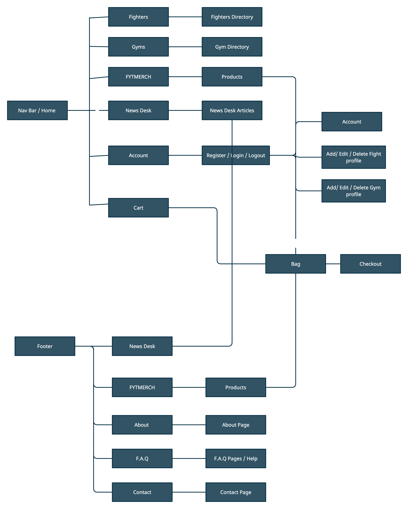


### **Static pages:** 
* Home / About / Contact / FAQ 

### **App: Shop** 
*  Product  page
*  Product detail page
*  Checkout / Success  (Logged in only)
*  Account administration (Logged in only)

### **App: Fytnet** 
*  Fighter index page
*  Fighter Profile page
*  Fighter Profile Form page (for front end admin) (Logged in only)

### **App: Gym** 
*  Gym index page
*  Gym Profile page
*  Gym Profile Form page (for front end admin) (Logged in only)


### **App: News Desk** 
*  News Desk index page
*  News Desk Article page (Logged in only)
*  News Desk Article Form page (for front end admin) (Logged in only)


### **Misc:** 
*  Register page
*  Login Page 


## **Menu Structure**

### **LOGGED OUT USERS:** 

#### **HOME---FIGHTERS---GYMS---FTYMerch---NEWSDESK---LOGIN---REGISTER :** 
* For logged-out users, the user will only have access to options which encourage registering to the site. A login option or a registration option alongside basic static pages for example the about and contact pages.


#### **LOGGED IN USERS:** 
### **HOME---FIGHTERS---GYMS---FTYMerch---NEWSDESK---ADD FIGHTER / GYM--- NEWSDESK :** 
* If the user is logged in, a more extensive list of menu items are available, for instance, the ability to add a fighter or gym profile and manage their account data through the account menu option. 
* An add fighter page will allow the user to manage their fighter profile update edit and delete, each with buttons for CRUD functionality.
* Admin users at this current time will manage the site administration from the django admin area to which a menu item will be available, to create front end forms and pages when Django has a built in admin area seems unncessessary.
* Finally logout for users to end their session and securely log out from the application, removing the session cookie. 


### **FOOTER - UNIVERSAL / LOGGED IN AND OUT:**
 **NEWS**---**_FYTMERCH_**---**ABOUT**---**F.A.Q**---**CONTACT**

* I decided to move alot of the standard and less important infomation down to the footer to allow the nav bar to contain only the main site goals of Fighters, Account and Gym infomation. As the Merchandise app is of lesser significance i deemed it more suitable to place in the footer, alongside the contact and questions links. Things users may need to find but are not essential enough to be on the main nav bar across each page. This would clutter the nav and fluidity of the site and is typical amongst larger projects. 


### **Information on structure regarding page layout and design:**
 The general structure of pages will consist of a navbar, a hero section utilising the django templating system to provide more information on the page the user is at, then to display relative content to that page, structured using the projects fonts, font sizing and aforementioned colour palette.

* As discussed earlier I have opted for a content block approach which will allow me to display content in a clean and structured manner. These two points allow the user to learn the layout and feel of the website quickly. For Django templating, more specifically the display of content such as fighters and gyms i will utilise the Bootstrap card elements and customise them to suit the structure and layout of the app. 

* Each page will have working navigation whereby the Nav Logo  (text or image) will return the user to the home or landing page.


* The footer/ Copyright consists of two sections positioned centraly and away from the edges of the site so that any information can be viewed without scanning from left to right on larger screen resolutions. I discovered this as I work on a 27inch iMac and having to content full width at this size is bad for UX in my personal experience.
Regarding the footer, section one or block one will have an information box
section the second will offer my contact details and any further links to static pages on the site, for example the About, contact and F.A.Q sections.

* Templated pages such as the gym and fighter detail pages will be laid out in two a two col structure on lager screens, displaying the main content in blocks utilising Bootstraps Material style (built using MDBootstrap container classes to add depth and a visually pleasing experience, compared with simple containers with no border etc.)


### **SCHEMA - DATA & MVC**

* Choosing a data structure for this project has been considered, and I have opted to use the POSTGRES relational database with a data model which is well organised and matches the schematics of the project. 
* As the project is to be deployed using Heroku i have used the bundled SQLite in developement and Heroku Postrgres for production. 

* Reasoning for using relational databases in this project was fundamentally due to allow multiple apps and tables to be linked with one another and data connected through the use of a ForeignKey. There are multitude of relationships employed in this app, including  one-to-one (example includes: User linked to fighter and gym) and One to many (example includes: One Gym being linked to many Fighters, thus the app feature, Join fightcamp and Fighter trains at: X gym.)


* All Data resides in POSTGRES and each app has the appropriate models developed to ensure that all data needed for the user is covered. 

* The below diagrams display the tables and the structure of my database as pre-planned when addressing MVC or regarding Django MVT framework conventions. 


## **Models** 


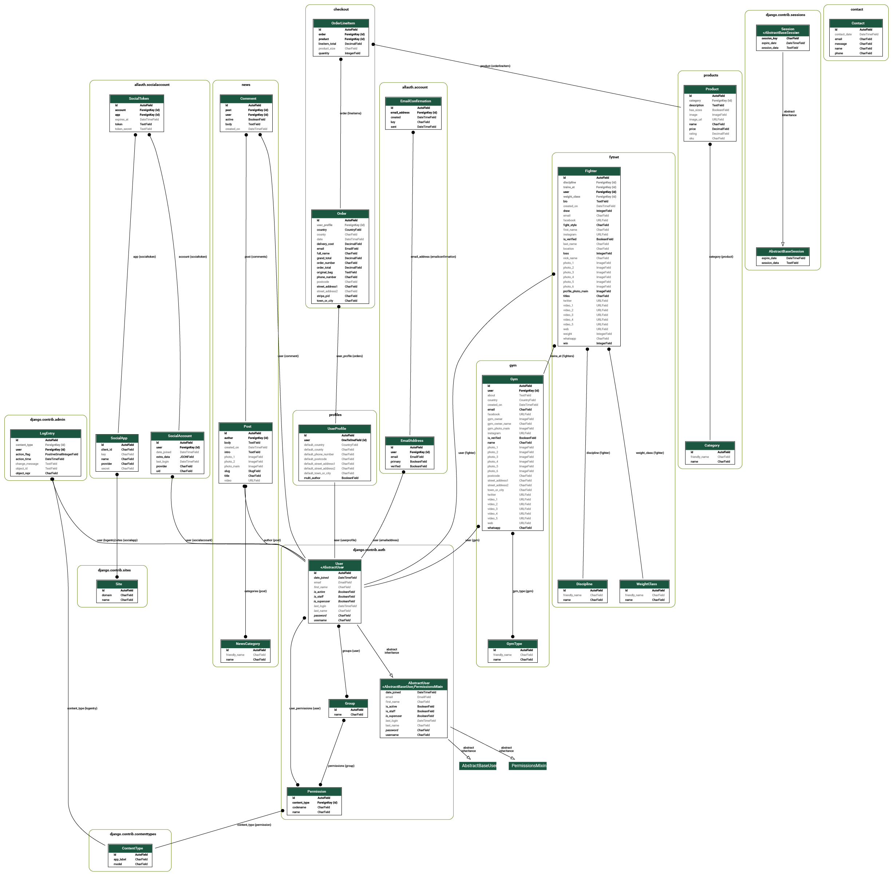

Generated by installing graphviz and generating a .dot file by running the command `python manage.py graph_models -a -g -o db_schema.dot --dot` and converting the data over at [GraphvizOnline](https://dreampuf.github.io/GraphvizOnline) to generate this high resolution .SVG file 

[**Click here for hi resolution SVG**](media/readme/graphviz.svg)


* Fighter model: Includes all fighter data and is linked to the user profile.
* Gym model: Includes all fighter data and is linked to the user profile.
* Products model: Includes all products in the shop.
* Profile model: takes the user as the primary key here and links the data across many of the other tables so that a registered users data is accessible across the tables and to their account. 
* News model contains all of the data pertaining to the creation of posts and commenting.
* Contact model - allows visitors to contact the site administration and the site admin to read the messages alongside their contact details in the admin panel. Linked to the Google SMTP server for admin notification emails on live deployed site.


## ✏️ **Skeleton Plane – Interface design, navigation design and giving form to function:**
___

* As with every project which is to be taken into production it was essential to firstly wireframe the project. This would allow me to test out different ideas layouts, navigation and presentation which is expected when visiting this type of website. I developed the wireframes using the Balsamiq software which allowed me to produce low fidelity mockups of the finished web application without the need for coding it first. This saved immensely on production time and allowed me to have a 'map' of how to finally code the app.

* _**Please note – these wireframes may differ slightly from the result.**_

___


#### **Wireframes.**


*  For a full pdf of my desktop wireframes for this project click here: **[Wireframes](media/docs/wireframes.pdf):**

 


### **Skeleton plane continued:**

In this project, we are focusing on data presented in a template using Django  and the input of that data provided by registered users of the application.


The data presented should be done so in a logical manner with ease on the eye and interesting to the end-user, it should also be simple to read and only present important data as to alleviate cognitive overload from the end-user. This is achieved by presenting only the important pieces of information from the fighter profile or gym profile as needed, in this case i will use the Gym scheme as an example: 

* Gym Name - using a secondary font
* Gym Profile image - As a heading / hero image.
* Bio - in bold part of  the first info block displayed to the user

* Gallery of images - utilising the lightbox plugin and employing an if else statement from Djangos templating to check for images and prevent blank data.

* Location and main infomation  - Displayed as a block of content grouped in a conscise way.

* Gym Owner - Displaying an Avatar small image to the right hand side of the page along with text underneath displaying the Gym owner name. 
* Verification section: Underneath the gym owner i have developed a system for the admin to choose wether a gym is verified or not, this is using a Boolean value in the Model, if True a verified check mark will be displayed alonside text telling the user that the listing of the gym is infact verified by the site administration. Increasing value to the user and the site owner, as this will encourage accurate and uptodate information. 
* Social network links - Displayed using font awesome and branded to the colour pallete as discussed in a previous section. 

* Media - I have added a media section in fhe form of a carousel (OWL) placed at the bottom of the listing, one to end the main content but to also not distract from the main Bio and other more important venue details. It is however still important to place this section as users may want to see video footage of the gym.


Navigation has been assembled in order of priority from left to right and all links and internal links are well displayed (many as buttons) and working.

Furthermore, I found no need for pagination at this point to display data and also provided menu items and buttons with relevant font awesome icons to aid in web application learning to the end-user. Data is presented the same throughout the web app alongside colours, fonts and branding all aiming to allow the end-user to learn the web app easily and subsequently enjoy using it.


## 🚀 **Surface plane:**
___

Using all the planes above and the data presentation and all the research carried out I was able to present all of this with my project.
I hope you enjoy browsing my web app and I look forward to developing it further.
In ending this UXD analysis and a quote I feel summarises this whole process I will leave you with this.

> “ Good UX smells like value. Ask yourself the question whenever you're building a project, does this smell like value?”

Brian O'Grady - Code Institute


## 📦️ **Features:** 
___

* The web app is mobile responsive with a collapsible toggler navigation. I used a mobile-first approach to this project ensuring that mobile access was of high importance.

* Further more i used a transparent sticky nav bar on desktop which adds a pleasing UX for the user, Background overlays used on scroll so menu options are visible throughout site nav.

* Cards used extensively, on the home page, import of models to the home app to allow for rendering of the latest content on the index.html page, ensuring upto date content is always displayed.

* Use of pagination for News, Fighters and Gyms, sorted by creation date, with listings of 6 per page, to ensure that congnitive overload is avoided, users can scroll through listings with ease. 


* The Logo position left always takes the user back to the Home page.

* Expected use of font-awesome icons to assist in users learning of the site.

* Use of animation for hero text - minimal use of animation but effective for a pleasurable experience on page load.

* Footer features on Index.html with information section populated with my information. 

* Extensive use of logic if else statements which render blocks if the user has infomation pertaining to those blocks, for example, the media blocks in gyms and fighter profiles, if the user hasnt uploaded at least one video to this  section the block doesnt render in the template, this condenses the templates and allows templates to look complete even with out a full profile.

* similarly if a user doesnt provide all social media links, they are greyed out, active social media links return branded colours alerting the user to the fact the profile has an active social media link. 


* Gym and Fighter Main pages  utilizes bootstrap cards which display FIghter image and content relevant to the fighter,, encouraging click through from the button below.  This was templated using the Django framework. This allowed the developer to create one template card which was used to create all the data cards for the users, through creating loops for the fighters. In time i will add pagination and sorting of these cards once the site grows in user data.

* A user-friendly interface with easy navigation and learning of the whole application, through minimal design, visuals and information presented in a predictable but expected fashion. 
Furthermore, all fonts and colour schemes are consistent throughout the application, from login panels to registration, all consistent to create a continuous feel and wholeness to the app. 
Expected font use and consistency in font sizing and weights allow for an easy reading experience. 

* Buttons are all styled the same and placed strategically to ensure the user has an enjoyable experience using the site. 

* Forms are all styled using MDBOOTSTRAP's form control and also Django Crispy Forms which allows for styling away from the Django default giving a slick and professional look instead of the standard form design. 

* Card use for listing and uniformity. I have used cards concurrently in my projects as I feel they are an exceptional way of containing and managing content to present on the site. 

* Search functionality - was extended to incorporate most iterations or expected search strings and enquiries, so if a user wants to search for products by category or string the search functionality can handle that. 

* Flash messages are employed to allow/alert the user if they have logged in, logged out, submitted added something to the shopping cart etc they will be alerted. 

* User registration with login and log out functionality - I added this functionality to showcase a strategy for encouraging users to return to the site, by having their registration on the site will be more appealing for return visits. 

* CRUD functionality for registered users: Allowing users to fully control the content they submit to the site allows for a return and frequent visits, not only that but it encourages social sharing of their content and to keep the content created up to date with minimal input from the administation. 

* Allowing 3rd party content creation - through user accounts we allow for 3rd party content to be created, not just from the site owner. This will allow for exponential growth to the site, in turn increasing traffic and allowing for better SEO results. 

* Mobile Responsive - This site has been tested to ensure that a mobile-first approach and layout is clean and effective, the delivery of content and readability on smaller devices was paramount. This was achieved by the use of the Bootstrap Grid system and custom CSS media queries allowing for content to be resized on smaller screens and thus utilising optimum screen real estate on smaller devices, all information is grouped and presented expectedly, aiding in ease of 'learning' for new and returning users. 

* Buttons have been used extensively to allow for easy navigation when scrolling.

* 404.html - This was not needed as part of this project however I did when testing my URLs mistype a few by accident, which returned server errors as expected, so I did a google search on how to implement a 404 page which will allow users to safely navigate back to the home page if they end up on a page which isn't expected or not found. This has been credited below however I feel this was a great addition to the site outside of the scope of the project but adds a lot of value to the site owner and end-user. I added a return to home button and incorporated the Navbar so that even if the user finds themselves lost they can easily return home or use the navigation bar to find what they were looking for, instead of using the back button or having to retype the address and refreshing the application. 

* Search bar with  shop function index search - all search strings were incorporated in to the search functionality including: 

* Youtube Embed - Allows the user to input the youtube embed URL to the database and display the youtube video on their fighter or gym page inside of a carousel. Giving the reader the chance to not only read about the fighter but view their fights or showreel etc.

* External plugins used: for example Lightbox to present image data in a professional mean, also Owl carousel to scroll through extra media data with ease, carousels are useful and i have it set to auto rotate, which allows content hidden to be displayed.


* Django admin - The admin of the site can add edit and delete anything from the administation section, mainly provided by Django, but i have ensured that all features, such as categories, fighters, gyms etc have all been registered to the admin panel using the register admin functions. 

* Django admin panel styled to conform to branding colours, for astetic purposes.


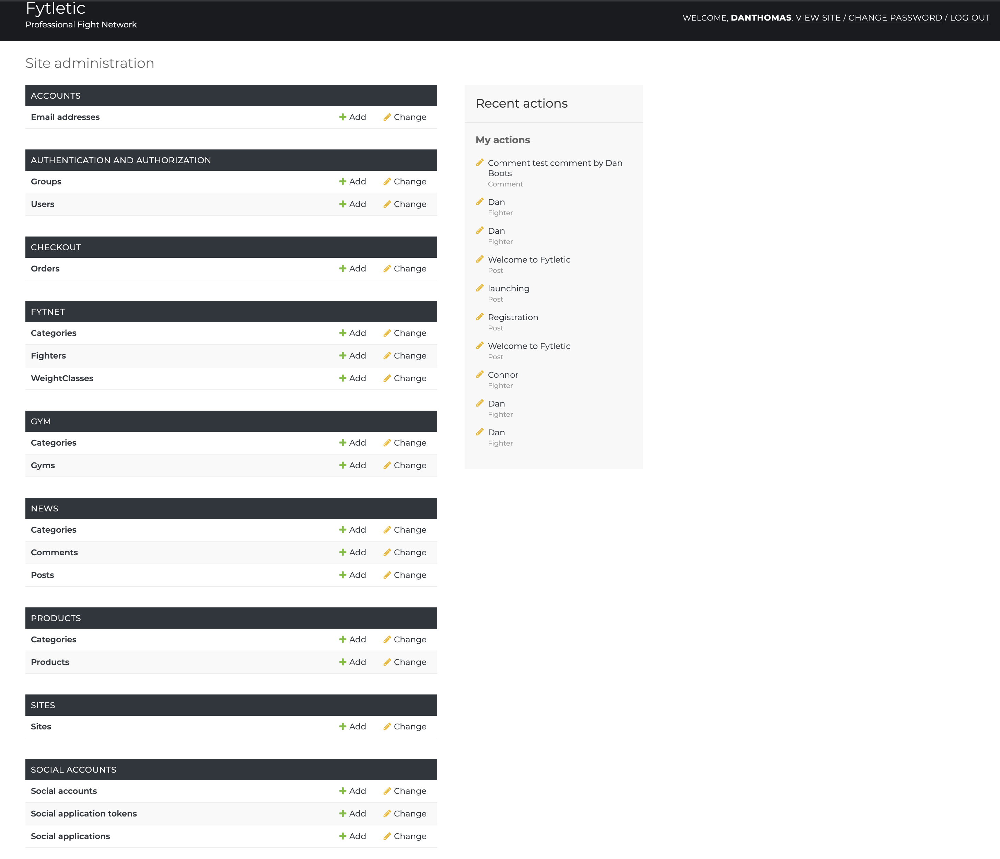 

* Verified Fighter or Gym - I added a custom piece of Python logic that allowed users to apply to the admin for verified status, to achieve this i added a Boolean to the the fighter and gym models this resulted in using an 'if' Python statement to check if the value of the Boolean is True to then display a verified check mark, if the Boolean is False, then nothing is returned or a greyed out check box is displayed, showing the user that this gym or fighter hasnt been through the relevant verification process.

## **Defensive design** - 

___

* Throughout this course i have been made aware, of defensive design, to which i fully understand how important it is for a web app to employ sufficient defensive design, i have build in a plethora of safeguarding features to this web app to ensure that the project is safe and secure, not only employing built in Django features but writing code on the back end to redirect users if they dont have the correct credentials. I feel with the amount of features i have built in this app i should highlight a few ways to how i have used defensive design to my advantage. 

* All forms utilise the Django CSRF token preventing cross site request forgery.

```
{{ comment_form | crispy }}
    
                 
```
* Crispy forms and Cross site Django tokens used, crispy form for styling, but CSRF allows for added security.


 Using Login required in views.py for different apps; This checks that the user is logged in and authenticated.


* Login required utilised Djangos built in safety features to check if the user is logged in and prevents rendering of the page if not, redirecting them back to a page unlogged in users are allowed to access.
```
@login_required
def edit_gym(request, gym_id):
```


* Preventing un authorised or non logged in users from editing urls, this bug i spotted late in to the project where by i was only protecting the fighter edit urls using an 'is_authenticated' method, which although prevented logged out users from accessing the url for any fighter or gym profile, it didnt provide protection against users who were logged in. By simply ammending the url any user could edit any other users profile. This was ammended  in the views for  both the gym add and fighter add class. 


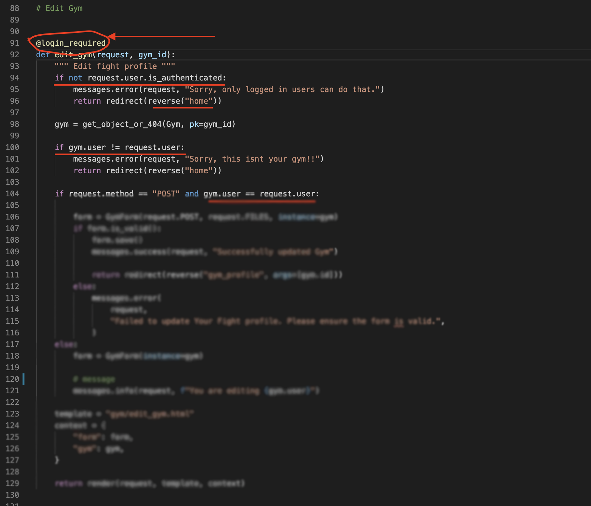

* This was achieved by firstly checking that the user is logged in `@login_requried`
* The code then checksif the user is authenticated if not, returns the user to home.
* The code then runs an if statement to see if the gym (or fight user) matches the request.user if they dont match the user is shown an error message and also redirected to the home page
* The code then checks if the method is a Post request and the gym.user is equal to the request.user, if true it then renders the form.


* **Fighter Gym profile claiming** - This logic i put in just as a quality control and spam protection for the site. I first extended the profile model to have a multi_author value, which is a boolean. If true the user can add as many profiles fighters gyms as he / she pleases. However as the value is set to `False` initially i then restrict profile creation or the links to profile creation to 1 fighter or one gym only per account. This works by restricting access to the add fighter or gym fighter button. If the user has added a profile and isnt multiauthor then they get a message saying their profile has been claimed, and no button or direct button access to add new profiles are available. If the user deletes their profile the button returns. 
The logic in the template simply uses a built in Django lengh filter to check against the number of profiles available and runs an if else statement to determine wether to render the profile add button or return a fighter claimed message.
Similarly if a user is a multi author the button to add profiles is always there. 


### **Multi - Author Managment view**


### **Standard User view**
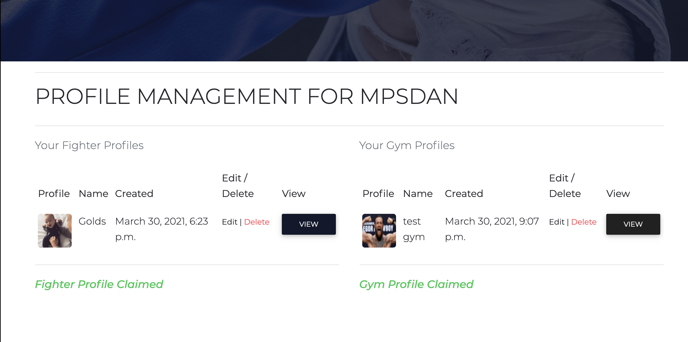

___


## **Email Notification - Contact app** - 

* Instead of using Email.js (which i did use in an earlier version of the app) i decided to build out a brand new app for handling contact requests, essentially meaning it can be extended to allow for users to contact gyms and fighters directly on the main site, instead of the standard email and phone buttons in the template. 
* The contact form checks to see if the user is logged in and fills in form data such as name and email address automatically from the database, the form on submit is logged in the Django admin and sends an email using the Google SMTP server to the administrator of the site and makes them aware that a user has contacted them, and to check the admin contact panel for infomation. 
The forms are rendered on the front end via crispy form styling and are complete with defensive design to prevent spam. 


### **Email Test**
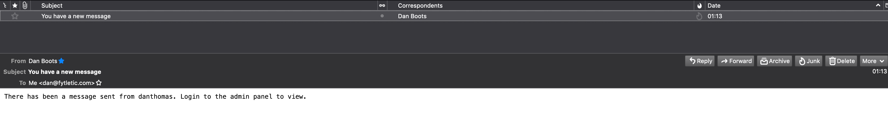


### **Standard User view**
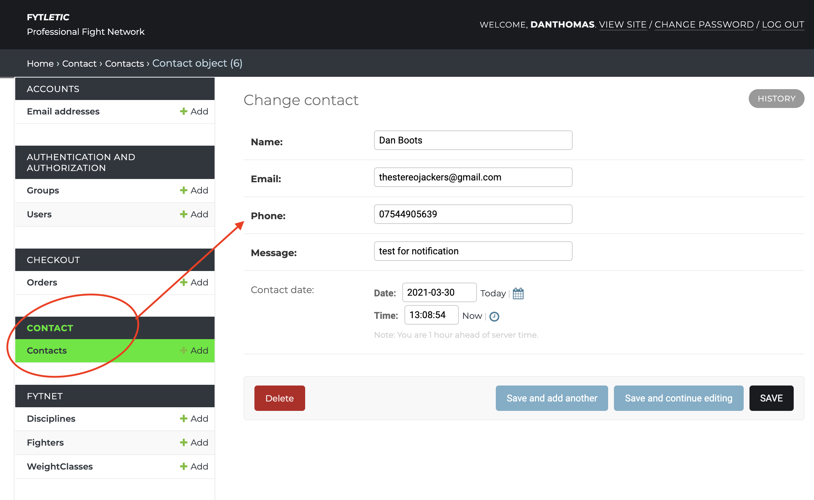

___

* Throughout


* Toasts and message popups used across the site to give feedback on user actions across the site.

* Font awesome icons used to increase user site learning, used in the footer and headers extensively.


## **Other App Specific features**

* **Home** - Ordering of the latest three Fighters, Gyms and latest news, ensures the home page is always upto date with the latest information, these are rendered as cards and styled with hover classes to be more visually appealing.

* **Products** - Fully functional ecommerce site, with stripe integration, security through stripe, quanity selectors crispy forms and toasts alerting users to bag updates, deletion and manual editing and deleting of products in the bag.


* **Gym** - Rendering of custom content and blocks dependent on information provided to the template. Carousel and lightbox using if else statements to render infomation only if present. 
Complete with Verification badges for users who have went through a vetting process so that their profiles are legitimate. 
Fight Camp, shows related fighters in an ordered list / table with links to their profiles. 
The use of telephone links and mail links on the profile page allow for mobile use, to quickly call or message the gym. Also a created message shows the status of when the profile was created, it has been styled in a green colour. 


* **Fighter Profiles** - Rendering of custom content and blocks dependent on information provided to the template. Carousel and lightbox using if else statements to render infomation only if present. 
Complete with Verification badges for users who have went through a vetting process so that their profiles are legitimate. 
The use of telephone links and mail links on the profile page allow for mobile use, to quickly call or message the fighter. Also a created message shows the status of when the profile was created, it has been styled in a green colour. 

* **News Desk** - Renders cards highlighting the latest news with links to the readmore button. 
The news profile allows users who are logged in to read the full article and post comments which are linked to their username (complete with delete comment functionality).
To encourage users to sign up, i have protected the news desk full body of the article using a filter to trunceate content and provided an if statement to render a block of text and a link asking unregistered users to sign up to read the rest of the article.
News articles render correct tags for later sorting into categories.
The template also renders the author name, when the article was posted and a link back to the main news desk page.

* **User Profiles** - Not only does the profile / account page for users contain all order history and information to update their account, it also has been extended to show all of the users Fighter and Gym profiles associated with the account, neatly arranged in tables complete with links to profiles and avatars. Quick links for editing and deleting profiles are also available.
I have also added a last login function, so that users are aware about how long ago they logged in and if they didnt then they will know that their account may have been compromised. 


### **Further Dev plans**: 

> **Ongoing project notice:** 

I feel this project satisfies the criteria set out to which I wanted to achieve however I have further plans to branch this project to create a better experience again for users and readers of the site to which may include: 

* **Follow fighters** - Develop something similar to twitter where users can follow their favourite fighters.

* **Top fighters** - A ranking system which will aid in getting exposure for fighters and encouraging on boarding of users to the network, this would be accomplished by filtering by and ordering fighter data by rank, and writing logic to allow users to rate the fighter.

* **User discussion forums** - may be of use so users can interact with one another or similar simple social network type functionality where users can add friends or follow fighters This will create a community, at present we have a commenting system but this may be extended. 

* **inboxing users** - by using a messaging system it will allow users to connect and converse with one another.

* **Categories** - As the site grows there should be a significant extension of the site layout to incorporate growth, this may be grouping fighters by discipline such as by UFC and Boxing and displaying only top or latest Fighters on the home page in a carousel and linking to a separate genre-specific page, this will help in allowing users to find and explore fighters and disciplines they are interested in.


* **Advertising space** - revenue generation or sponsored fighters - allowing fund generation for the site in return for better site positioning or exposure. 

* **Implement the live keys** - to the merchandise shop to allow for customer purchases.

* **Forums** - for discussion and a hub for the latest discussions on fight topics.

* **Allowing a user to create news content for the site** - so again extending the functionality of the site to allow 3rd party content creation and site expansion. 

* **Addition of the Google Maps API** - a great feature would be for gyms to input their address and a map pin be generated for the profile of the gym allowing users to find the gym quickly and easily. 

* **Events app** - UFC and other events listings to be added to a specific events and calendar app.


### **_Code Refactoring_:** 
___
* In this project I also used the extension to Gitpod called prettier which would format my code, however, I then went through each page and ensured there were no excess lines of whitespace. I also chose a uniformed way of commenting display, whereby I left a line gap either side of my comments so that people can distinguish between code blocks. I feel it was just a neat way to format my comments. 

* Furthermore, to this, I used an online tool which formats my HTML and CSS to conform to best practice, so in my final (for deadline purposes) commits I will be formatting the HTML code from the formatter, as credited below.  

* Pep* compliance - to ensure that best practices were followed i used correct Pep8 formatting within the project, this included following correct indentation and using the Black python code formatter and python linting.

## 🧪 **Testing:**
___

* Testing was an integral part of the design and build process, responsiveness is crucial to the success of any online website so several steps were employed to ensure that the site worked across several platforms and browsers.
Not only responsiveness but positioning, colours, inheritance etc were all factors to be taken into consideration, thus Google Chrome developer tools were used extensively to test all aspects of the site.
Although Bootstrap is a mobile-first approach I opted to work on a simple desktop version first as I could work backwards.
I first of all set up a few .css rules for the body section which allowed me to set some global rules such as.

<!-- Code Blocks -->
``` Css
  * {
  box-sizing: border-box;
}
```
Which made sure that I was working with the box model more logical. 

*  Google Developer Tools was essential in working through alot of the design process as you can see real time what different css properties are doing to the page. I found myself relying on Dev tools alot more as ive progressed in web development.


## 🧪 **User Experience testing:**


* As this website is aimed at getting users to interact with the site through viewing fighter or gym profiles or by registering to the site to become a user of the site I had to ensure that in my testing I adequately tested the UX and that it was simple enough for the user to "learn" how to use the site and follow industry standards and user expectations.

* This translated into me using a top menu bar with LOGO positioned to the left as expected.
For this website, I haven't provided an extensive array of menu options, only as much as necessary to accomplish what the site sets out to achieve. So at this point in the web application infancy, I haven't set menu options for the latest additions, top fighters or  top ranked Gyms etc. I am keeping it basic to maintain simplicity.

* I used many inbound links and tested all links ensuring that they all work and link correctly, I had to test each page template thoroughly as these pages are generated from user data pulled from PostgreSQL and all buttons and cards dynamically create their pages templated from the Django templating system 

* I have logged my testing below to ensure that this web application is 100% functional and complies with defensive design.


### **User Experience: from top to bottom testing each feature for bugs**

#### **Home / Navigation.**

* Home Button always returns the user to index.html
* Logo always returns the user to index.html
* Profile menu item always directs users to their profile page.
* Add fighter menu item, always directs users to the add fighter form.
* Add Gym menu item, always directs users to the add Gym form.
* Login directs users to the login page
* Logout logs out users and removes session cookie for the user.

#### **Merch Shop / cards.**
* Home Button always returns the user to index.html
* Clicking product image takes user to product detail. 
* Clicking on quantity buttons increments and decrements value
* Add to basket adds product to basket
* Shopping cart total updated and accessible across the site.
* Shopping cart takes you to your basket.
* Checkout takes you to the payment form.
* Adjust bag returns the user back to the bag page 
* Checkout takes you to the payment form.
* Complete order loads the stripe payment gateway for payment handling.

#### **GYM / cards.**

* Home Button always returns the user to index.html
* Card: For loop tempating, displays gyms in a card deck with pagination (correct and working)
* Card: Img Top displays correct image
* Card: Gym name displays correctly.
* Card: Gym location displays correct
* Card: Gym created on date displays in date format.
* Card: Button takes user to correct gym listing
* Card: verification logic displays blue tick for verified gyms and non for non verified gyms.
* pagination: previous, next and number links all work with correct logic, if no prevous then button is disabled, similarly if no next button is also disabled.

#### **GYM / Single Template.**

* Home Button always returns the user to index.html
* Hero Image displays correct image from models.
* Hero heading displays gym name, animation present and correct.
* About block retrieves about info from models.
* GYM image main displays 
* Lightbox logic loads correct amount (max 6) of images available.
* Verified gym logic working.
* location retrieved from database and displayed in the template
* Address retrieved from database and displayed in the template
* Specialises in retrieved from database and displayed in the template
* Call number retrieved from database and displayed in the template
* Email infomation retrieved from database and displayed in the template
* social media links retrieved from database and displayed in the template
* listing detail retrieved from database and displayed in the template
* back to gyms button returns user to gym page. 
* media, images or video retrieved and displayed in carousel if applicable.


#### **Fighter / cards.**

* Home Button always returns the user to index.html
* Card: For loop tempating, displays fighterters in a card deck with pagination (correct and working)
* Card: Img Top displays correct image
* Card:fighter name displays correctly.

* Card: Button takes user to correctfighter listing
* pagination: previous, next and number links all work with correct logic, if no prevous then button is disabled, similarly if no next button is also disabled.

#### **Fighter / Single Template.**

* Home Button always returns the user to index.html
* Hero Image displays correct image from models.
* Hero heading displays fighter name, animation present and correct.
* About block retrieves about info from models.
*fighter image main displays 
* Lightbox logic loads correct amount (max 6) of images available.
* Verifiedfighter logic working.
* location retrieved from database and displayed in the template
* Address retrieved from database and displayed in the template
* Specialises in retrieved from database and displayed in the template
* Call number retrieved from database and displayed in the template
* Email infomation retrieved from database and displayed in the template
* social media links retrieved from database and displayed in the template
* listing detail retrieved from database and displayed in the template
* Join fight camp button adds user to list of linked users 
* back to fighter button returns user to gym page. r
* media, images or video retrieved and displayed in carousel


#### **News Desk / Cards.**

* Home Button always returns the user to index.html
* Card: For loop tempating, displays news article in a card deck with pagination (correct and working)
* Card: Img Top displays correct image
* Card: News article name displays correctly.
* Card: News article location displays correct
* Card: News article created on date displays in date format.
* Card: Button takes user to correct article listing
* pagination: previous, next and number links all work with correct logic, if no prevous then button is disabled, similarly if no next button is also disabled.


#### **News Article / Single Template.**

* Home Button always returns the user to index.html
* Hero Image displays correct image from models.
* Hero heading displays Article heading name, animation present and correct.
* title displays correct.
* Main image retrieved from database.
* Author name and avatar displayed.
* Date posted retrieved.
* Back to news desk button takes user back to news desk.
* Logged in logic wil prevent non logged in users from reading full article, only the intro.

* Comments - block displays correct along with comment count 
* Comments - leave a comment form renders using crispy form.
* Comments -  form posts data ready for admin approval.
* Comments - Related news displays 


####  **Contact.**

* Contact form renders and uses CSRF token 
* Contact form defensive design asks users to fill in name and if logged in returns the user name.
* Contact form asks for email address (required) and will return user email address if logged in.
* Contact form renders and asks for phone number 
* Contact form renders form input for message and is a required field. 
* Submit button posts the data to the Django admin panel and emails the admin making them aware of a contact message form. 
* Google maps renders in the head section of the contact us container.


#### **Register.**

* Register - Takes two inputs to the form Username and Password both utilising defensive design. 

* Register - button successfully registers the user to the database. 

* Login - already a member login href, redirects user to the login page.


**Screen size testing**


As displayed, I used the Responsive Viewer Chrome plugin to test a multitude of the most popular screen sizes available. Which included.

* Medium Screen - 1024x800 
* Large Screen -  1280x800
* iPhone 8,7,6S,6 - 375x667
* iPhone 8 Plus, 7 Plus, 6S plus - 414x736
* Galaxy S9 Plus, S8 Plus - 412x846
* Pixel 3, 3 XL - 393x786
* Galaxy S9, Note 8, S8 - 360x 740
* iPhone XS, X - 375x812
* iPhone XR, XS MAX - 414x896


___

### **Further Testing:**
* The use of validation services for **[Jigsaw CSS Validator](https://jigsaw.w3.org/css-validator/)** and **[HTML Validator](https://validator.w3.org/)** allowed me to modify and fix any errors in my code, 


### **Results from CSS and HTML validation:** 
No errors found I did use the direct input to the CSS validator service as I am using external frameworks such as Bootstrap and MDBOOTSTRAP which did return some warning errors when using the URL input. However, these are out of my control so opting for direct input of my CSS allowed me to test my code only. 

### **CSS Results:** 

* CSS testing found only errors withing the MDBootstrap CSS - all written CSS passed validation, apart from WebKit-animation and WebKit-filter which is an external library I used for  H1 animations and out of my control. 


### **PEP8 Results:** 
* No problems resulting from PEP8 testing and compliance of all python3 .py files  using  **http://pep8online.com/**
All major tests passed and no errors and indentation all correct.

* Note: the only exeption i have left in this is the lengh too long error, if time permitted i would go back and correct these 'errors' but as it stands the line lengh doesnt break site functionality therefore will be classed as known and to be ammended moving forward in a new branch.


### **HTML Results:** 
* All HTML pages validated and passed tests however using Django and the way we extend from the base template we do see expected errors in each page such as Doctype must be declared first and special character escaping, however, this cant be circumvented and I am aware and happy to proceed with this. 

* This was carried out and then also templates rendered were formatted so that code is clean and legible to anyone browsing the repo or working on the project moving forward.


### **Other Testing criteria:**


* I Used the Gitpod built-in HTML testing.


* Emmet is also a great testing tool as if you do get errors or unclosed tags it will suggest to you the closing tag to use. I find this very helpful in bug fixing and testing.

* I have an extension installed called PRETTIER which is referenced in technologies, which I employed for correct 

* I finally used **[GTMETRIX](https://gtmetrix.com/)** which is used to test page website speeds. All testing came back fine apart from image sizes which scored pretty low. Thus I used the free online **[SQUOOSH](https://squoosh.app/)** to reduce massive image sizes up to 80% of their original file size. 
This is especially important as large image sizes dramatically increase page loading speeds and leads to a bad UX especially on mobile where heavy loading sites can eat data very quickly. 

___
### **Testing Issues / known bugs:**

## 🏭️ **Deployment:**
 ___

* This project was developed using the Gitpod IDE which integrates seamlessly with Github, Git pod is a cloud IDE so this allowed me to work at home on my iMac or out on my iMac using only an internet connection and the website **[GITPOD workspaces](https://gitpod.io/workspaces/).** 

* The site was developed inside of the Gitpod IDE and connected to my GitHub repository. 
As sections of the site were completed I ensured that I used version control to maintain copies of my code on the repository. This was achieved via commands on the terminal integrated with Gitpod.

* The python code - Only known issues with the code are some lines being too long. Again all code has been formatted with Black which still introduced this after formatting and will be dealt with in a new branch moving forward.


### **Steps in using version control and getting ready for Deployment**

1. `git status` - would give me a list of the files which have been edited and ready for staging.
1. `git add .` - I used this command to add **all** files to the staging area instead of adding each file individually I used the `.` after `Git add` which allowed all files to be added at once, I found this workflow quicker and easier.
1. `git commit -m"Message"` - This is the command to commit the changes and the message allowed me to know what or significant changes had been made.
1. `git push` - Was used to push to the remote repository, in this case, **GitHub**

* When working it was also necessary to view the changes to the website, for this I mainly used preview, as the save function allowed instant refreshes and updates reflecting my changes. However for fullscreen testing in a separate tab, I employed the use of the command `python3 manage.py runserver"` to open a port on my local machine, instructions were to make the port public then open in the browser. 

## **Deployment to Heroku**


* This project is connected to Heroku using automatic deployment through connection to my GitHub repository, all media and static files are hosted on Amazon Web Services S3 bucket. 
this was achieved through the following steps. 


### **Prerequisites and optional features:**

* This site supports a merchandise shop and the payment gateway used was Stripe, if you would like to use stripe you can sign up for an account here [Stripe](https://www.stripe.com/)

* Emails are handled by connecting to Gmail you will need a Gmail account if you wish to implement this feature, sign up for an account here: [GMAIL](https://www.gmail.com/)

1. Firstly and foremost one should create a new repository over at GitHub creating an env.py file to store sensitive data.


2. Log in (or Register) to [Heroku](https://www.heroku.com/) and from your dashboard click 'new' > 'create new app'.
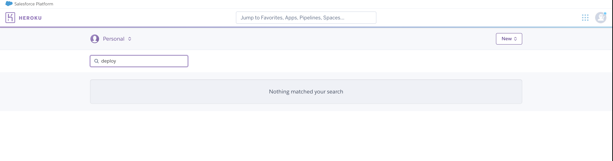


* Name your app something unique and select the region closest to you, in my case this is Europe.
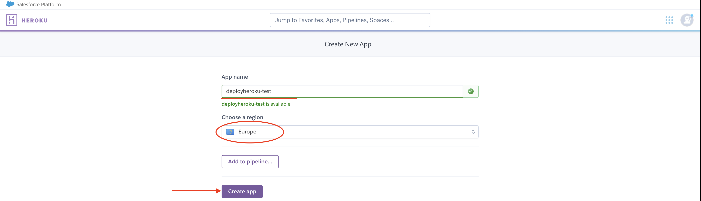

3. Then on the 'Resources' tab, search and add the Heroku Postgres database, for normal projects the free option is usually sufficient.

4. To connect Postrges with Django we need to install a couple of dependencies, dj_database_url and psycopg2, this is achieved by typing the below commands in the terminal 

```
$ pip3 install dj_database_url
$ pip3 install psycopg2
```

5. We need to freeze these into a specific file called requirements.txt to ensure that Heroku installs all the apps requirements when deployed, we do this by entering the below command in the terminal

```
$ pip3 freeze > requirements.txt

```

6. We use two databases in our app, namely sqlite3 which comes as default for django and Postgres, in development we are using sqlite, so to implement this we need to replace the default database URL with a call to dj_database.url.parse and pass in the credentials from Heroku 

```
# DATABASES = {"default": dj_database_url.parse("DATABASE_URL")}
```
this takes care of the database for Heroku deployment, however we need to ammend our code after we make the initial Heroku Migrations, so to do this type in the terminal 

```
$ python3 manage.py migrate

```
As we are connected to the Postgres database you should create a superuser, in order to login to the backend of the app. we do this by typing in the terminal : 

```
$ python3 manage.py createsuperuser
```
and following the prompts.


7. After this is completed migrating we then ammend the code to allow us to use both sqlite in development and postres for Heroku Deployment. 
This is achienved by using the code below in replace of the database config above. 

```
if "DATABASE_URL" in os.environ:
    DATABASES = {"default": dj_database_url.parse(os.environ.get("DATABASE_URL"))}
else:
    DATABASES = {
        "default": {
            "ENGINE": "django.db.backends.sqlite3",
            "NAME": os.path.join(BASE_DIR, "db.sqlite3"),
        }
    }

```


8. Once connected head over to the settings tab on Heroku and click on the reveal config Vars button as shown below 

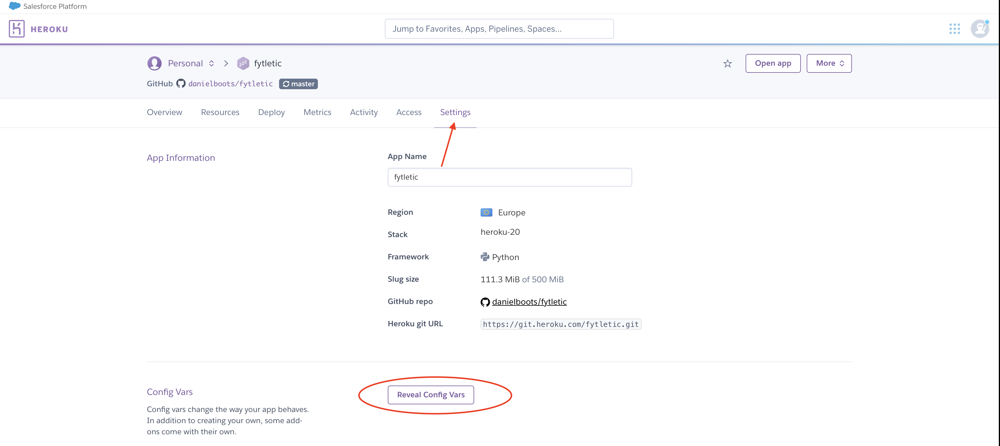


We use config vars to input our sensitive data and store it on Heroku so Heroku has access to these values, as they are the same values contained in the env.py file which isn't uploaded to Github. 

the variables required are as follows (key and value pairs) and are to be input exactly like your env.py file.


| KEY      | VALUE     | 
| :------------- | :----------: |  
|  **AWS_ACCESS_KEY_ID** | USER SPECIFIED   | 
| **AWS_SECRET_ACCESS_KEY**  | USER SPECIFIED | 
| **DATABASE_URL**      | USER SPECIFIED| 
| **EMAIL_HOST_PASS**   | USER SPECIFIED | 
| **SECRET_KEY**        | USER SPECIFIED | 
| **STRIPE_PUBLIC_KEY**   | USER SPECIFIED | 
| **STRIPE_SECRET_KEY**   | USER SPECIFIED | 
| **STRIPE_WH_SECRET**   | USER SPECIFIED | 
| **USE_AWS**   | TRUE | 
|

9. Install gunicorn using the following command;

`
$ pip3 install gunicorn
`

Then freeze into your requirements file.


10. Create a Procfile in the same level as the requirements.txt
Inside of the  Procfile and add the following line;

`
web: gunicorn fytletic.wsgi:application
`

11. Once this step has been completed we can then push our requirements and Procfile to GitHub using the commands in the terminal ` git add requirements.txt ` ` git add Procfile ` 

` git commit -m"added requirements and Procfile" ` 

then push to GitHub using `git push` command in the terminal.

* Connect up Github for automatic deployment - from the Deploy, tab select Github from deployment method.
Head over to the Deployment tab on Hero and under Automatic deploys click Enable Automatic Deploys' and then Deploy Branch See below. 


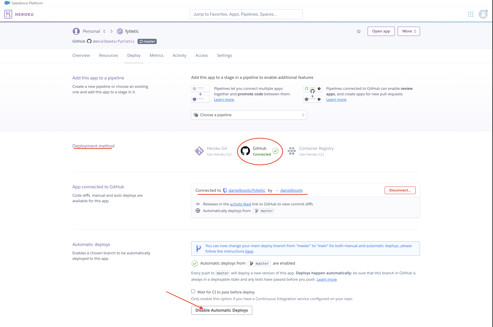

 * On the Github connect section ensure that your GitHub profile is visible than on the right-hand side box, type in a repo from GitHub to search for. Preferably it is advised that you keep uniformity within Heroku and GitHub so try to keep the same names for each. For this example, I have used Fytletic.

* Following these steps correctly will allow Heroku to receive code from your Github repo and build the Django app using the correct packages and dependencies. 

 * Once the build has completed you will get a message informing you that ' your app was successfully deployed' and you can then launch your app. 


## **How to clone or run this project natively using HTTPS.**


If you should require to fork or obtain a copy of this website you can follow these instructions. 

1. Visit my Github repo here **[Fytletic](https://github.com/danielboots/fytletic):**


2. Click on the GREEN clone or download button, located at the top right of the page see screenshot below.


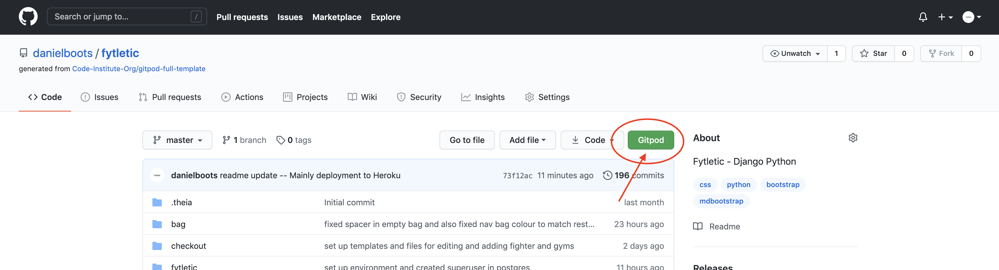
    

3. Click on the "clipboard" also located on the right now seen as a dropdown box. You can either click the clipboard or the URL if using URL method remember to right-click highlighted URL and copy.
4. Open your IDE and open a new terminal window.
5. Change the directory path to a location in which you want to clone the repo too. 
6. Paste the Git URL and click ok / Clone


## Git bash instructions: 

1. open git bash type in git clone then plaste the URL copied from the repo as highlighted above.

`
$ git clone https://github.com/YOUR-USERNAME/fytletic.git
`

3. press enter and git bash will create your local clone.

4. Note once set up, it is important that you set up any sensitive data in your environment settings or add a env.py file to your workspace and ensure that it is included in your git ignore file so that secret keys,database keys etc dont end up in version control. 

5. Install all requirements using the command: 


`
$ pip3 install -r requirements.txt
`

6. Next Apply migrations. 

`
python3 manage.py migrate
`

this will ensure that the database your using is set up correctly with the models created in the app. 

7. Create a superuserto allow access to the django admin panel 
`
python3 manage.py createsuperuser
`

8. finally you can run the project locally with the command:

`
python3 manage.py runserver
`

___


## 🤝 **Credits Acknowledgements and References.**
___

### **Content**
The content for the site was developed by myself from my own experience with the core code for the site being adapted from Project Django, Ado from Code Institute.


### **Media - images** 
Throughout my project, I used various sources for media - 
The content such as stock images for the website were taken from envato elements to which i have a subscription. 

* Gym images and inspiration for dummy data from:  https://generationiron.com/5-best-gyms-world-need-train-die/

### **Code Snippets** 

* **NavBar** - MDBootstrap -https://mdbootstrap.com/docs/jquery/navigation/navbar/

* **Forms** - MDBootstrap - https://mdbootstrap.com/docs/jquery/forms/basic/
* **Cards** - MDBootstrap - https://mdbootstrap.com/docs/jquery/components/cards/

* **EmailJS** - Error onload, fixed using answer from stackoverflow - https://stackoverflow.com/questions/26107125/cannot-read-property-addeventlistener-of-null

### **Python help:**
* **Stackoverflow** = https://stackoverflow.com/questions/4617674/what-does-it-mean-for-an-object-to-be-unscriptable/16618872

* **Django Docs** = https://docs.djangoproject.com/en/3.1/

### **Tutorials** 
The initial code for this application was based on  the Django app tutorial from code institute, as part of my full stack web developer course, I could not have achieved this fully functional CRUD application without the extensive and comprehensive guide which I followed and adapted to my own needs. 

* https://djangocentral.com/building-a-blog-application-with-django/ - Aided in building out the Newsdesk.

* https://djangocentral.com/creating-comments-system-with-django/ - Adapted code for developing the comments system on the news desk.

* https://www.udemy.com/course/python-django-dev-to-deployment - this course has been fantastic and i emplore anyone getting in to Django to check it out, it helped greatly in my knowledge of databases and also the code from this project was adapted to allow me to use pagination with great success. 

* https://docs.djangoproject.com/en/3.1/ref/views/ - The Django docs were used in order to implement a 404 page.


### **Custom Code** 

* Help from the CodeInstitute team: 

```
multi_author = profile['multi_author']
2. then in context add:
'multi_author': multi_author
3. then in template you can access it {{ multi_author }}

```


### **Animation Css External Libraries** 

* **Animation Hero text** - Animista library - https://animista.net/play/text/focus-in/text-focus-in

### **Additional** 

* **Code Institute Projects** - Previous projects were referenced when needing to job memory on **HTML** structure or some **css** classes.
* **[Gitpod Emoji Code 0.9.0](https://github.com/idleberg/vscode-emoji-code#readme):** - Allows emoji use in markdown. 
* **[FavIcon- Instructions](https://www.youtube.com/watch?v=pA8103S-yqk):** - Allowed me to add a FavIcon to my site.
* **[FavIcon- Converter](https://www.icoconverter.com/):** - Allowed me to Convert my 16x16px photoshop image to a .ico file.


### **Thanks** 

*I would like to thank my mentor for this project Reuben who has helped me with the initial planning, the custom models including the Gym and Fighter network, his knowledge and support have been crucial in me completing this project i honestly couldnt have added alot of the functionality with out his expertise and help. 

Id like to say a big thanks also to the mentor and tutor team at Code Institute who have been patient and helpful in helping me with support and guidance especially, Alan, Tim, Igor and Sheryl. 

Id like to thank my fiance once again who has let me stay up way too long every night the past month so i could hit the deadline, although ive been up with my daughter in the night too! Im ready for a small rest! But again my daughter and my son who are a massive part of my motivation for completing this course, this project is for you all! 

Id like to also thank everyone at Code Institute and the Learning people especially Stuart Crang, who started me on this journey. At the beginning i didnt know what a div was, now ive wrote this web app in Django, he has caused many sleepless nights for me but its all been worth it! 

To anyone else, you know who you are. 


### **Contact:**

> If you have enjoyed using this project or wish to connect with me my direct email is: 
**_dan@fytletic.com_**
Thanks for passing by! 
